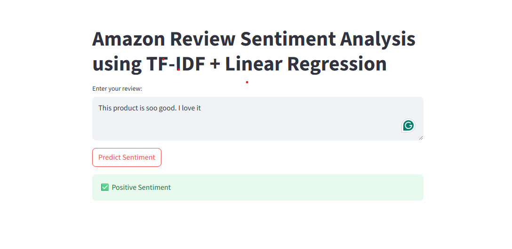
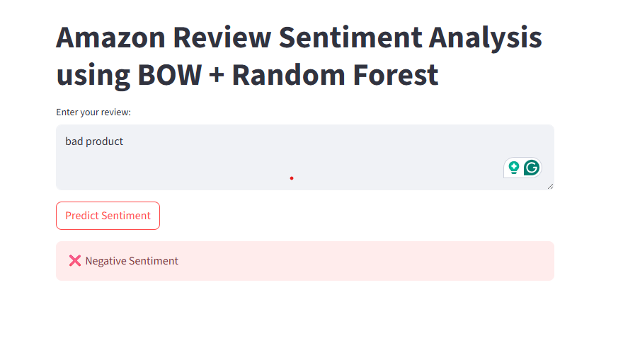

# 📝 Amazon Reviews Sentiment Analysis (NLP Project)

This project focuses on building a **sentiment analysis system** for **Amazon product reviews** using **Natural Language Processing (NLP)** techniques. The goal is to classify reviews into three categories:

* ✅ **Positive**
* 😐 **Neutral**
* ❌ **Negative**

We explored different ways of representing text and experimented with multiple machine learning models. After tuning hyperparameters, we identified the best-performing models for each representation and deployed them using **Streamlit** for interactive testing.

---

## 🔹 Project Workflow

### 1. Data Collection & Cleaning

* Dataset: `Reviews.csv` (Amazon product reviews)
* Preprocessing steps:

  * Remove punctuation
  * Convert text to lowercase
  * Remove stopwords
  * Lemmatize words
  * Remove HTML tags

A new column `cleaned_text` was created to hold the processed reviews.

---

### 2. Label Creation

* Score > 3 → **Positive** (label `2`)
* Score = 3 → **Neutral** (label `1`)
* Score < 3 → **Negative** (label `0`)

---

### 3. Vectorization

We used two different text representation methods:

* **Bag of Words (BOW)**
* **TF-IDF (Term Frequency–Inverse Document Frequency)**

Separate vectorizers were saved so that predictions could be reproduced later.

---

### 4. Model Training & Hyperparameter Tuning

* With **BOW features**, the **Random Forest Classifier** performed best.
* With **TF-IDF features**, **Logistic Regression** performed best.
* Hyperparameter tuning was carried out for both models.

The final saved files are:

* `sentiment_model_POW.pkl` + `vectorizer_POW.pkl`
* `sentiment_model_TFDDL.pkl` + `vectorizer_TFDDL.pkl`

---

### 5. Deployment with Streamlit

Two separate Streamlit apps were built:

* `app_pow.py` → loads **BOW + Random Forest model**
* `app_tfddl.py` → loads **TF-IDF + Logistic Regression model**

Users can enter a review and instantly see whether it is classified as **positive, neutral, or negative**.

---

## 🔹 Outputs

### ✅ Output 1: TF-IDF + Logistic Regression

---

### ✅ Output 2: BOW + Random Forest

---

## 🔹 Summary

This project demonstrates the full lifecycle of an NLP pipeline:

* Data preprocessing
* Feature extraction (BOW & TF-IDF)
* Model training and hyperparameter tuning
* Model saving (with vectorizers)
* Deployment using Streamlit

With two optimized models and separate Streamlit applications, this project shows how different vectorization strategies can influence sentiment classification performance on Amazon reviews.
